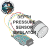

# IRT C++/ROS 2 Depth Pressure Sensor Simulator

[](https://opensource.org/licenses/BSD-3-Clause)



<!--- protected region package header begins -->
**Author:**
- Maximilian Nitsch <m.nitsch@irt.rwth-aachen.de> (Institute of Automatic Control - RWTH Aachen University)

**Maintainer:**
  - Maximilian Nitsch <m.nitsch@irt.rwth-aachen.de> (Institute of Automatic Control - RWTH Aachen University)
<!--- protected region package header ends -->

## Description
This project provides a high-fidelity depth pressure sensor (DEPTH) simulator written in C++.

The simulator implements the following features:
- Depth-pressure measurement simulation
- Full-scale accuracy simulation
- Full-scale resolution simulation
- Range simulation
- Static bias simulation (i.e. by atmospheric pressure)
- Pressure-to-depth conversion
- Stochastic noise
- All parameters can be configured in a YAML file
- All models and effects can be enabled/disabled separately

Example configurations for KELLER Series 10LHPX sensors are provided.

## Table of Contents

- [Dependencies](#dependencies)
- [Installation](#installation)
- [Usage](#usage)
- [ROS 2 Nodes](#ros-2-nodes)
  - [Publishers](#publisher-node)
  - [Subscribers](#subscriber-node)
- [Coding Guidelines](#coding-guidelines)
- [References](#references)
- [Contributing](#contributing)
- [License](#license)

# Dependencies

This project depends on the following literature and libraries:

- **Eigen3**: Eigen is a C++ template library for linear algebra: [Eigen website](https://eigen.tuxfamily.org/).
- **ROS 2 Humble**: ROS 2 is a set of software libraries and tools for building robot applications: [ROS 2 Installation page](https://docs.ros.org/en/humble/Installation.html)).


# Installation

To install the `dpth_sensor_simulator_package`, you need to follow these steps:

1. **Install Eigen3**: Eigen3 is a dependency for your package. You can install it using your package manager. For example, on Ubuntu, you can install it using the following command:

    ```bash
    sudo apt-get install libeigen3-dev
    ```

2. **Install ROS 2 Humble**: Ensure you have ROS 2 (Humble) installed. You can follow the official installation instructions provided by ROS 2. Visit [ROS 2 Humble Installation page](https://docs.ros.org/en/humble/Installation.html) for detailed installation instructions tailored to your platform.

3. **Clone the Package**: Clone the package repository to your ROS 2 workspace. If you don't have a ROS 2 workspace yet, you can create one using the following commands:

    ```bash
    mkdir -p /path/to/ros2_workspace/src
    cd /path/to/ros2_workspace/src
    ```

    Now, clone the package repository:

    ```bash
    git clone <repository_url>
    ```

    Replace `<repository_url>` with the URL of your package repository.

4. **Build the Package**: Once the package is cloned, you must build it using colcon, the default build system for ROS 2. Navigate to your ROS 2 workspace and run the following command:

    ```bash
    cd /path/to/ros2_workspace
    colcon build
    ```

    This command will build all the packages in your workspace, including the newly added package.

5. **Source the Workspace**: After building the package, you need to source your ROS 2 workspace to make the package available in your ROS 2 environment. Run the following command:

    ```bash
    source /path/to/ros2_workspace/install/setup.bash
    ```

    Replace `/path/to/ros2_workspace` with the actual path to your ROS 2 workspace.

That's it! Your `dpth_sensor_simulator_package` should now be installed along with its dependencies and ready to use in your ROS 2 environment.

## Usage

1. **Configure your YAML file** for your DEPTH sensor or use the default file.

2. **Start the DEPTH sensor simulator** with the launch file:
    ```bash
    ros2 launch dpth_sensor_simulator_package dpth_sensor_simulator.launch.py
    ```
  The DEPTH sensor simulator prints your settings and waits for a ground truth odometry message.

3. **Provide an odometry publisher** from you vehicle simulation.

4. The DEPTH sensor values should now be published.

**Important Usage Information**:
- The odometry message must be published with at least the DEPTH sensor data rate/sample time.
- The message `*/diagnostic` will show `WARN` if the odometry rate is lower.
- If no odometry message is published, the message `*/diagnostic` will show `STALE`.
- If everything is correct, `*/diagnostic` will show `OK`. 

## ROS 2 Nodes

The DEPTH sensor simulator node implements one publisher and subscribes to one topic.

### Publishers

This node publishes the following topics:

| Topic Name       | Message Type        | Description                        |
|------------------|---------------------|------------------------------------|
| `*/depth_pressure`   | `nanoauv_sensor_driver_interfaces/DepthPressure.msg`   | Publishes depth pressure sensor data.|


### Subscribers

This node subscribes to the following topics:

| Topic Name        | Message Type        | Description                        |
|-------------------|---------------------|------------------------------------|
| `*/odometry`| `nav_msgs/Odometry.msg`| Subscribes to ground truth vehicle odometry.|

## Coding Guidelines

This project follows these coding guidelines:
- https://google.github.io/styleguide/cppguide.html
- http://docs.ros.org/en/humble/The-ROS2-Project/Contributing/Code-Style-Language-Versions.html 

## References

The DEPTH simulator implementation closely follows the work:
- M. Nitsch, "Navigation of a miniaturized autonomous underwater vehicle exploring waters under ice," Dissertation, Rheinisch-Westfälische Technische Hochschule Aachen, Aachen, RWTH Aachen University, 2024. [DOI: 10.18154/RWTH-2024-05964](https://www.researchgate.net/publication/382562855_Navigation_of_a_Miniaturized_Autonomous_Underwater_Vehicle_Exploring_Waters_Under_Ice?_sg%5B0%5D=xNyP6RXVcEfazembhPB6cRxGQTBAvWqw6qMza26FExHUVzWcV9VUd35T4l6KjUqbo1a7W6okgPi3zqqUQYww5dmfZgsQcoJlvBE3ss1T.JLcM4K_iQyfJO7N73P9ebOmEd0xchppKYQemo5hh6ecobLxw5ZSaPgwEvlqYcQtr25iVtPvdMorpxfHK_Oldag&_tp=eyJjb250ZXh0Ijp7ImZpcnN0UGFnZSI6ImhvbWUiLCJwYWdlIjoicHJvZmlsZSIsInBvc2l0aW9uIjoicGFnZUNvbnRlbnQifX0).

## Contributing

If you'd like to contribute to the project, see the [CONTRIBUTING](CONTRIBUTING) file for details.

## License

This project is licensed under the BSD-3-Clause License. Please look at the [LICENSE](LICENSE) file for details.

